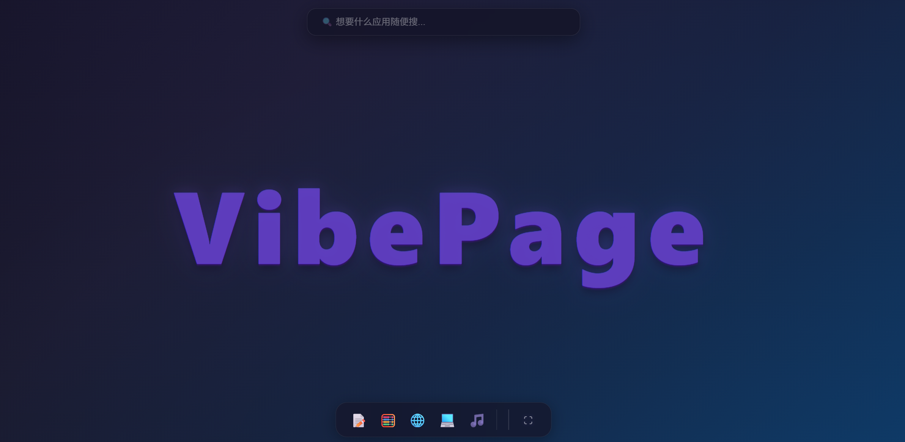

# VibePage

AI 驱动的全幻觉桌面，输入应用名称即可生成可运行的网页应用。



## 功能

- 🔍 输入任意应用名称，AI 实时生成完整的可运行 HTML 页面
- 🤖 三种交互模式：纯前端逻辑 / 键盘回车 / AI 重新渲染
- 💡 搜索框实时推荐应用名称
- 🪟 多窗口管理，支持拖拽、最小化、全屏

## 快速开始

### 1. 配置 API 密钥

编辑 `config.json`，填入 API Key：

### 2. 源码启动

```bash
node server.js
```

启动后自动打开浏览器访问 `http://localhost:3001`。

### 3. 打包为 EXE

```bash
npm run build
```

生成的 `dist/VibePage.exe` 双击即可运行（自动检测端口冲突，重复启动会弹窗提示）。

## 项目结构

```
vibeos/
├── server.js              # 主服务器（零依赖，纯 Node.js 内置模块）
├── config.json            # API 密钥配置
├── package.json           # 项目配置 & 打包脚本
├── public/
│   ├── index.html         # 主页面
│   ├── css/style.css      # 样式
│   └── js/
│       ├── app.js         # 应用入口 & 搜索逻辑
│       ├── ai-generator.js # AI 生成器（含截断检测）
│       └── window-manager.js # 窗口管理器
└── dist/                  # 打包输出目录
```

## 技术栈

- **后端**：Node.js 原生 HTTP 服务器，零依赖
- **前端**：原生 HTML/CSS/JS，无框架
- **AI**：DeepSeek API（`deepseek-v4-flash`）
- **打包**：[pkg](https://github.com/vercel/pkg) → 单文件 EXE
